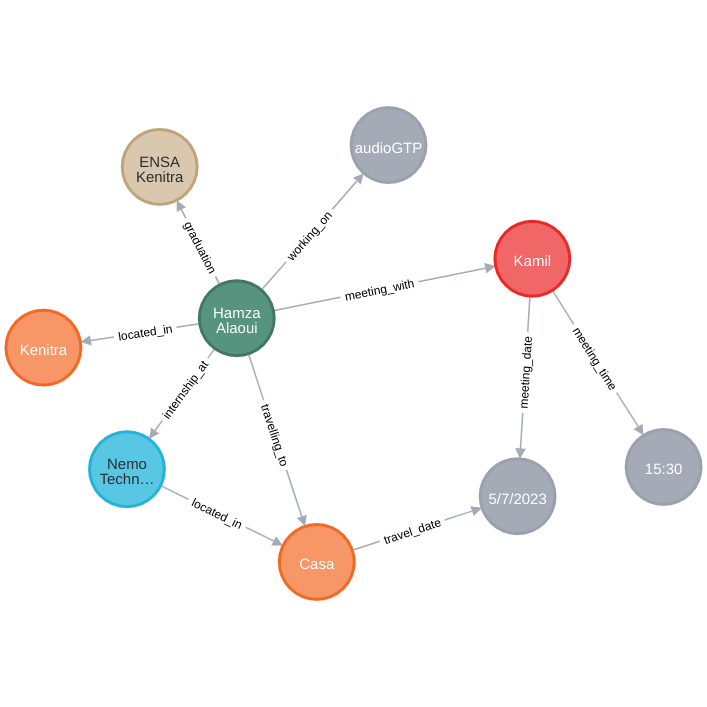

# Approche proposée pour la gestion d'état dans les modèles GPT utilisés pour les chatbots
### Ou comment créer JARVIS

## Problématique
L'application audioGPT se veut être une IA assistant personnel. En plus de pouvoir parler (TTS) et comprendre quand on parle (STT), elle devra se rappeler de certaines informations, comme par exemple les rendez-vous ou les réunions que l'utilisateur a programmés. Ces informations sont faciles à conserver dans une base de données, en admettant qu'on a pu les extraire du texte. Mais un assistant doit aussi mémoriser des informations moins évidentes à conserver de par leur nature, et aussi plus difficile à extraire du texte, comme par exemple : les noms des personnes et leurs relations avec l'utilisateur, les informations sur les activités du user, les profils professionnels, les conversations et interactions IRL etc...

Stocker ces informations, qu'elles soient structurées ou non, n'est pas utile si on ne sait pas quand les utiliser. Ici, je parle du contexte de la conversation avec audioGPT. Les humains changent de contexte de conversation tout le temps, et ils n'ont même pas besoin de faire un effort pour se rappeler des informations utiles aux conversations. On peut atteindre un résultat similaire en augmentant la taille des prompts envoyés à l'API de chatGPT (ou autre LLM) mais les coûts vont augmenter, et le temps de réponse aussi, sans être sûr que les informations pertinentes seront dans le prompt envoyé.

Les problèmes sont donc :

- Identifier et enregistrer les informations pertinentes dans la DB
- Interroger la DB de manière à recevoir uniquement les informations pertinentes pour un contexte.

## Critères de succès
Il nous faut donc concevoir une mémoire humaine pour audioGPT. Celle-ci doit :

- Être capable de se rappeler des informations les plus subtiles données dans nos messages
- Pouvoir changer de contexte sans friction, de manière naturelle (comme un humain)

## Recherches et hypothèses
Par intuition, avant même de faire une recherche, j'ai tout de suite pensé à un Knowledge Graph. Ce serait le moyen de stocker les informations "comme une mémoire humaine". Donc, j'ai creusé cette piste.

Un knowledge graph, ou graphe de connaissances en français, est une représentation structurée des connaissances et des relations entre différentes entités du monde réel. Il s'agit d'une base de données qui organise les informations en utilisant des nœuds (ou entités) et des arêtes (ou relations) pour représenter les liens entre ces entités.

Le knowledge graph est conçu pour capturer et représenter les connaissances de manière sémantique, permettant aux utilisateurs de naviguer, d'explorer et de rechercher des informations de manière efficace. Il facilite également l'inférence, la découverte de nouvelles relations et la compréhension contextuelle des données. Les knowledge graphs sont souvent utilisés dans des domaines tels que l'intelligence artificielle, la recherche d'informations, l'exploration de données et la gestion des connaissances.

Mes recherches m'ont amené à la conclusion que le plus grand défi ne sera pas de stocker les informations mais plutôt de les extraire du texte. Les modèles et bibliothèques NLP disponibles, qu'ils soient payants ou open source, leur manquent tous un élément essentiel pour les knowledge graphs : l'extraction de relation.

J'ai été ravi de trouver un post intitulé "Entity and relation extraction fine-tuning" de "gonespral" sur OpenAI Developer Forum qui est arrivé à la même conclusion que moi.

Solutions proposées :
1. Fine-tuning d'un modèle GPT-3 sur des échantillons du jeu de données DocRED pour une extraction plus précise des relations au niveau du document.
2. Incorporer les types de relations/entités souhaitées à extraire dans le prompt pour une extraction plus flexible.

Dans cette image de diagramme :
- Long term memory représente le Knowledge Graph.
- Short term memory est une base de données relationnelle classique qui enregistre les conversations.
- Extract relevant data et identify needed data sont des modèles GPT fine-tuned pour exécuter leurs tâches.

## Test

Dans cette section, nous allons décrire les étapes que nous avons suivies pour tester notre approche. Nous avons utilisé ChatGPT-3 et ChatGPT-4 pour simuler l'effet des modèles fine-tuned que nous prévoyons d'utiliser.

**Étape 1: Créer une conversation avec une IA assistant personnel**

Pour commencer, nous avons créé une simulation d'une conversation avec une IA assistant personnel en utilisant ChatGPT-3. Nous avons défini le rôle de l'IA comme un assistant qui se souvient des informations pertinentes et pose des questions à l'utilisateur pour obtenir ces informations. De plus, l'IA a également la tâche de répondre aux questions de l'utilisateur en utilisant les données qu'elle a recueillies.

Vous pouvez accéder à la conversation via ce lien : [conversation avec AI](https://chat.openai.com/share/ec46290c-920d-44b4-8f19-3f7fc012f2e2)

**Étape 2: Extraction des informations**

Ensuite, nous avons utilisé ChatGPT-4 pour extraire les informations pertinentes de la conversation. Nous avons constaté que ChatGPT-4 était plus efficace pour extraire les informations pertinentes que ChatGPT-3.5. Cependant, il aurait été préférable de préciser les relations possibles entre les entités pour faciliter le travail de l'IA.

Voici le lien vers la conversation où l'extraction d'informations a été effectuée : [extraction d'informations](https://chat.openai.com/share/e2f0742f-acd2-4faa-94fd-88d27faf6bb1)

**Étape 3: Insertion des données dans le Knowledge Graph**

Nous avons ensuite inséré les informations extraites dans un Knowledge Graph (KG) en utilisant la base de données Neo4j. Cette étape a également été réalisée en utilisant ChatGPT.

Voici le lien vers la conversation où l'insertion des données dans le KG a été effectuée : [insertion des données](https://chat.openai.com/share/bffd95a4-5bb6-414a-9e7f-49ce0d0a9d3b)

Nous avons constaté que les informations ont été correctement insérées dans le KG. Cela nous laisse croire qu'il est tout à fait possible de finetuner GPT-3 pour qu'à partir d'un texte, il crée un script Cypher (l'équivalent de SQL pour Neo4j) pour insérer les données dans le KG.

**Étape 4: Répondre à une question à partir des données du KG**

Enfin, nous avons utilisé ChatGPT pour créer une liste de requêtes pour extraire les informations pertinentes de la BD. Le lien suivant mène à la conversation où nous avons simulé cette tâche : [répondre à une question](https://chat.openai.com/share/cb14a4a0-12e6-4e6e-b3f2-0133e059eb20)

Nous avons constaté que la commande Cypher générée par l'IA, "MATCH (user:User)-[:MEETING_WITH]->(person:Person) RETURN person", répond effectivement à la question de l'utilisateur, "yes, tell me if I have any meetings".

**Évaluation des résultats et Conclusion**

Le test, bien que timide, a suffisamment concrétisé le potentiel de cette solution. Définir les labels et les relations ainsi que leurs propriétés, en plus d'utiliser les capacités du langage Cypher, s'avérera très utile pour fine-tuner GPT-3 pour l'extraction de données et l'interrogation de la BD.